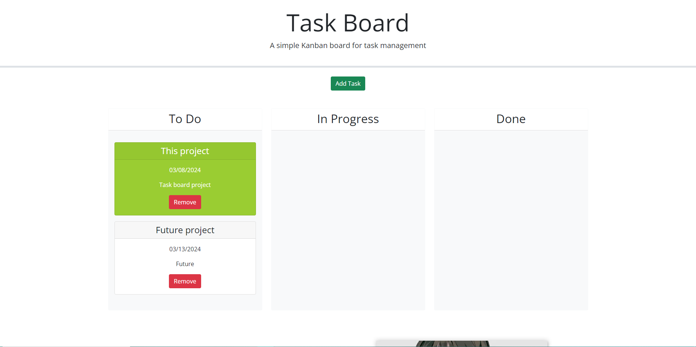

# task-board
Task board for projects.

## Description

- I wanted a concise place to have all of my future projects that I will be working on.
- I wanted to build on my skills with JQuery and bootsrap
- It gives me an easy way to orginize all of my projects future past and present
- I learned how to use Jquery and bootsrap.

## Usage

click add task then add as many tasks as you like.

## Credits

Source code:
- https://github.com/coding-boot-camp/musical-happiness

Useful link:
- https://coding-boot-camp.github.io/full-stack/github/professional-readme-guide

## Screenshot

## Link

https://domas09.github.io/task-board/
